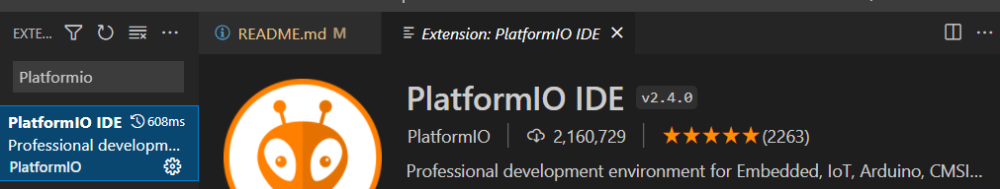
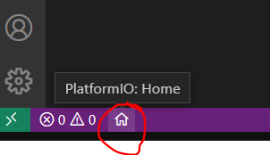
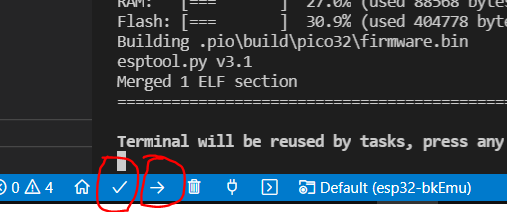

# esp32-bkEmu
BK-0010 Emulator (БК-0010)

## Hardware
[VGA32 v1.4 Board](http://www.lilygo.cn/prod_view.aspx?TypeId=50033&Id=1083)

## What it can do
* Emulate [BK-0010](https://en.wikipedia.org/wiki/Electronika_BK)
* Load file in .BIN format from SD card (not all files are working)
* Beeper sound

## Third party software
This project uses several libraries:
* (GPL v3.0) Display video using VGA, process PS/2 keyboard, and sound output: https://github.com/fdivitto/FabGL
* (unsure, MIT?) PDP-11 emulator by Eric A. Edwards: https://github.com/emestee/bk-emulator

## Plans for the future / issues
* Save snapshot
* Too fast, needs a slowdown
* Covox
* Timer
* BK-0011?

## Getting Started with VS Code and PlatformIO IDE for ESP32
* Install [Visual Studio Code](https://code.visualstudio.com/)
* Installing PlatformIO IDE Extension on VS Code:
  * Click on the **Extensions** icon or press **Ctrl+Shift+X** to open the Extensions tab
  * Search for **“PlatformIO IDE”**
  
  * Click **Install** button
  * After that, the **PlatformIO** icon should show up on the left sidebar as well as an **Home** icon that redirects you to PlatformIO home
  * Click to Platformio **Home** 
  * Click **Open project** button and select **esp32-bkEmu** folder
  * After that connect **VGA32 v1.4 Board** to USB port and click **Build** and **Upload** 
   
