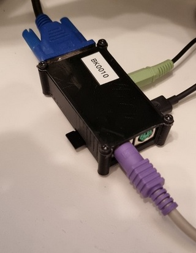

# esp32-bkEmu
BK-0010 Emulator (БК-0010)

## Hardware
* [VGA32 v1.4 Board](http://www.lilygo.cn/prod_view.aspx?TypeId=50033&Id=1083)
* [TTGO VGA32 V1.4 3D case (optional)](https://www.thingiverse.com/thing:4675382)

## What it can do
* Emulate [BK-0010](https://en.wikipedia.org/wiki/Electronika_BK)
* Load file in .BIN format from SD card (not all files are working)
* Beeper sound

## Third party software
This project uses several libraries:
* (GPL v3.0) Display video using VGA, process PS/2 keyboard, and sound output: https://github.com/fdivitto/FabGL
* (unsure, MIT?) PDP-11 emulator by Eric A. Edwards: https://github.com/emestee/bk-emulator

## Plans for the future / issues
* Save snapshot
* Too fast, needs a slowdown
* Covox
* Timer
* BK-0011?

## Sowtware Tools
* Getting Started with [VS Code and PlatformIO IDE for ESP32](/docs/VSCodeHowTo)
* Graphics [bitmap file to C-style hex converter](https://github.com/robertgallup/python-bmp2hex)

