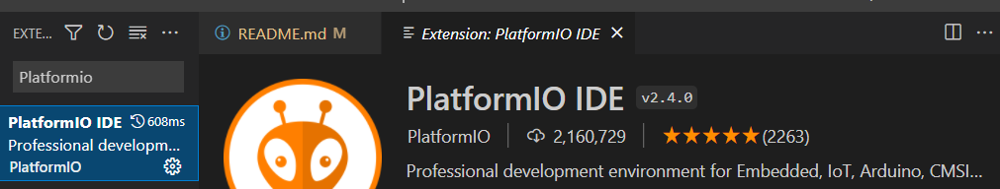
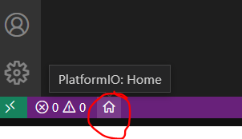
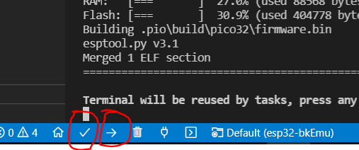

## Getting Started with VS Code and PlatformIO IDE for ESP32
* Install [Visual Studio Code](https://code.visualstudio.com/)
* Installing PlatformIO IDE Extension on VS Code:
  * Click on the **Extensions** icon or press **Ctrl+Shift+X** to open the Extensions tab
  * Search for **“PlatformIO IDE”**
  
  * Click **Install** button
  * After that, the **PlatformIO** icon should show up on the left sidebar as well as an **Home** icon that redirects you to PlatformIO home
  * Click to Platformio **Home** 
  * Click **Open project** button and select **esp32-bkEmu** 
  * After that connect **VGA32 v1.4 Board** to USB port and click **Build** and **Upload** 
   
